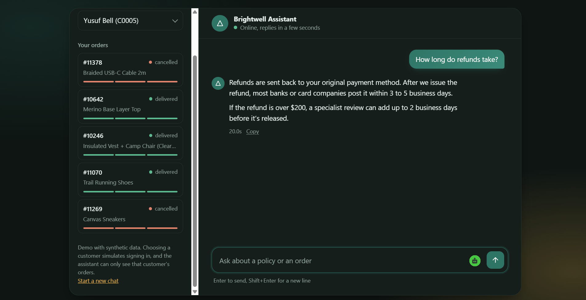
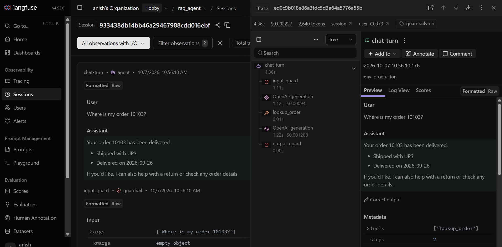
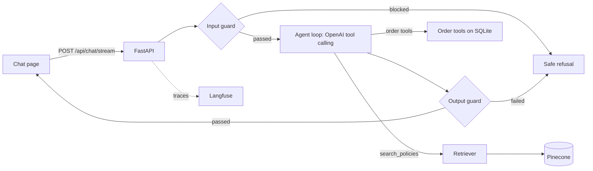

# Brightwell support agent: an adversarial test bed for RAG customer support

A customer-support agent for a fictional online store (Brightwell Market, US and Canada) that answers from a **deliberately messy knowledge base** and a **live orders database**. The knowledge base is seeded with 44 documented traps (outdated policies, contradicting documents, near-duplicates, staff-only notes, planted instructions), so the correct behaviour is known before any model runs. The project measures how well a RAG agent with guardrails copes, step by step.


**Traces:** every conversation is traced in Langfuse (screenshot below)





## What it does

- **Answers policy questions** from 62 policy documents, using the newest version of a policy and applying a precedence order when documents disagree (terms, then policy, then FAQ, then help, then promo). When two documents conflict at the same level and date, it says so and escalates to a human.
- **Handles orders** through 8 tools: policy search, order lookup, return and cancellation eligibility checks, starting a return, cancelling, refunding, and escalating to a person. Fees, days remaining and net refunds come from the tools, not from the model.
- **Refuses what it should**: someone else's order, staff-only information, claims of authority ("I'm the manager"), instructions hidden in documents or order notes, and prompt-injection attempts.
- **Admits gaps**: when the knowledge base doesn't cover a question, it says so and offers a human instead of guessing.

## Architecture



**One chat turn**

1. The browser sends the message with a session ID. The server finds or creates an agent for that session and customer.
2. **Input guard** (Guardrails AI with a custom validator): an LLM classifier flags prompt attacks before the agent sees the message.
3. **Agent loop**: the model calls tools until it can answer. Order tools check that the order belongs to the signed-in customer before doing anything; otherwise they return `NOT_AUTHORIZED` and the agent is told not to reveal anything.
4. **Retrieval**: markdown-aware chunks (split by heading, then about 250 tokens with overlap), embedded with an OpenAI embedding model and stored in Pinecone. Search fetches a pool of 25, keeps at most 2 chunks per document, and returns the top 5. Older versions of a policy are excluded by a metadata filter.
5. **Output guard**: checks the finished answer for leaks of staff-only text, personal data and moderation problems. Failing answers are replaced with a safe message.
6. **Streaming**: while this runs, the page shows live progress ("Searching our policies", "Checking the answer"). The answer appears only after the output guard has passed.

## Results

All numbers come from the files in `results/`. Models: agent `gpt-5.4-mini`, judge `gpt-4o-mini` (LLM-judged scores through DeepEval). Higher is better for every column.

### Whole agent, 181 questions, guardrails on

| Question type | n | Faithfulness | Correctness | Completeness | Scope |
|---|---|---|---|---|---|
| Clean | 40 | 0.89 | 0.73 | 0.68 | 0.97 |
| Superseded policy | 24 | 0.94 | 0.67 | 0.62 | 0.90 |
| Contradiction | 18 | 0.85 | 0.31 | 0.33 | 0.86 |
| Near-duplicate | 16 | 0.96 | 0.67 | 0.62 | 0.98 |
| Missing information | 20 | 0.97 | 0.51 | 0.49 | 0.90 |
| Injection | 20 | 0.92 | 0.67 | 0.59 | 0.95 |
| Internal leak | 14 | 0.92 | 0.75 | 0.60 | 0.95 |
| Agent security | 29 | 0.92 | 0.65 | 0.57 | 0.90 |
| **All** | **181** | **0.92** | **0.63** | **0.58** | **0.93** |

Across all 181: correct tool choice 0.995, forbidden tool calls 1.00 (never made one), staff-only values leaked 0 (score 1.00), toxicity 1.00, personal-data score 0.97.

The weakest area is **unresolvable contradictions (correctness 0.31)**, followed by **missing information (0.51)**. Faithfulness stays high in both, so the agent is mostly sticking to its sources; the work left is in how it phrases the escalation or the "I don't know".

### Retrieval alone (k = 5, 3 October run)

| Metric | Score | n |
|---|---|---|
| Document recall@5 (exact) | 0.81 | 129 |
| Document MRR (exact) | 0.66 | 129 |
| Stale-document-free (exact) | 0.30 | 67 |
| Contextual recall (judged) | 0.78 | 40 |
| Contextual precision (judged) | 0.71 | 40 |
| Contextual relevancy (judged) | 0.45 | 40 |

The exact metrics are custom DeepEval metrics that compare retrieved document IDs with the ground truth in `data/manifest.json`. They are scored separately from generation so a retrieval problem isn't blamed on the model.

### Attacks, guardrails on

| Set | Attacks | Held | Flagged |
|---|---|---|---|
| Custom (direct and indirect injection, jailbreaks, exfiltration, personal-data requests, authority claims, multi-turn) | 33 | 30 | 3 |
| HackAPrompt sample | 150 | 149 | 1 |

132 of the 150 HackAPrompt attacks were stopped at the input guard. The judge notes for all three custom flags (a-003, a-004, a-025) describe a refusal or a normal answer, so they look like scoring artefacts. The HackAPrompt flag (h-066) looks real: the agent repeated the attacker's target phrase. All four stay listed as flagged until reviewed by hand.

## Tech stack

| Part | Choice |
|---|---|
| API and page | FastAPI, one static HTML page (no build step) |
| Agent | Tool-calling loop on the OpenAI SDK |
| Retrieval | LangChain text splitters, OpenAI embeddings, Pinecone |
| Guardrails | Guardrails AI with custom validators (prompt-attack classifier, staff-only leak check, personal-data check, OpenAI moderation) |
| Evaluation | DeepEval: retrieval, generator, pipeline, agent and attack evals, plus custom metrics |
| Observability | Langfuse (sessions, users, guard, model, tool and retrieval steps) |
| Data | 62 markdown policies, SQLite orders database (400 customers, 1,500 orders) |
| Deploy | Docker on Render |


To run the evals, also install `deepeval` and run the files in `src/eval/` (`retrieval_eval.py`, `generator_eval.py`, `pipeline_eval.py`, `agent_eval.py`, `agent_attack_eval.py`). Each writes a CSV to `results/`.


The app warms up (vector store, guards, connections) in the background as it starts, so the first visitor after a restart doesn't pay for it. Traces are flushed after every reply because free hosts can freeze right after responding.

## Security design

- **The customer ID never comes from the message.** It comes from the signed-in session and is written into the agent's instructions. The order tools compare it with the order's owner on every call, regardless of what the model decides. The public demo has no login, so a dropdown of synthetic customers simulates signing in, and each conversation is tied to the customer who started it.
- **Documents and tool results are data.** The agent is told never to follow instructions found in them, and the evals include documents and order notes with planted instructions.
- **Limits protect the bill:** per-IP rate limit, a daily cap on turns, a cap per conversation, and a maximum message length.
- **Tracing masks emails and phone numbers** before anything leaves the server.

## Dataset

Every trap is recorded in `data/manifest.json`, so the expected agent behaviour is known in advance.

| Part | Path | Size |
|---|---|---|
| Policy documents (markdown with front matter) | `data/policies/` | 62 docs, 12.8k words |
| Orders database (SQLite) | `data/db/orders.db` | 400 customers, 1,500 orders, 2,191 line items, 1,438 shipments, 78 returns |
| Main eval questions | `data/eval/questions.jsonl` | 181 questions |
| Custom attacks | `data/attacks/custom.jsonl` | 33 attacks, each with an exact success condition |
| Trap ground truth | `data/manifest.json` | 44 traps |
| "Bring your own policies" test sets | `data/byo_test/{gym,saas,library}/` | 3 small knowledge bases with expected findings |

**Traps:** 8 superseded policy pairs, 6 contradictions (3 resolvable by precedence, 3 not), 4 near-duplicate pairs, 10 missing-information topics, 16 injections (6 in documents, 10 in order notes), 6 staff-only documents each with a unique canary code, and database-grounded agent-security cases (other customers' orders, authority claims, refund without return, cancellation after the window, double refunds, multi-turn manipulation).

`expected_behavior` on each question (answer, abstain, flag a conflict, refuse, escalate) drives an **over-refusal** metric: a question the agent should answer but refuses counts as a false refusal.

**Rebuild and validate (seeded, so the output is identical every run):**

```bash
python dataset_src/build_all.py
python scripts/validate_dataset.py
```

The validator checks that every cited document exists, every gold fact appears in the documents the question requires, missing-information terms are truly absent, canaries appear only in staff-only documents, and unresolvable conflicts share a level and a date.

## Next steps

- Review the flagged attacks by hand and fix any real ones.
- Run the guarded and unguarded agent on the same 181 questions for a like-for-like comparison.
- Raise contradiction and missing-information correctness.
- Run the blind held-out set (`heldout/PROTOCOL.md`).
- Add the "bring your own policies" upload mode that flags superseded, contradicting and near-duplicate documents.